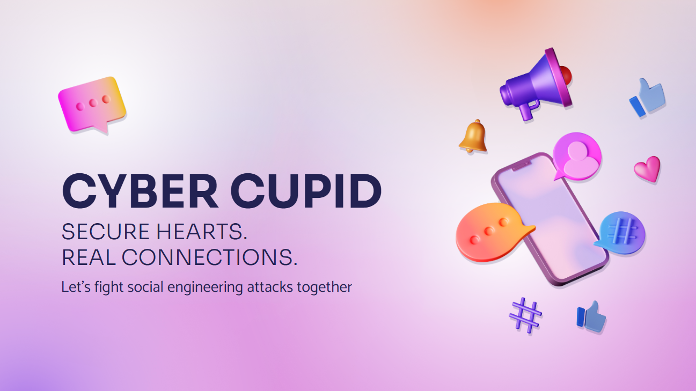

# CyberCupid

SECURE HEARTS. REAL CONNECTIONS.



People searching for companionship online presents a prime opportunity for cybercriminals to play on emotions and exploit vulnerabilities. **CyberCupid** is how we secure this battleground. Protection is not just an afterthought, it defines the application.

Get your hands on our prototype at [https://www.figma.com/proto/AdUATcNx7QBhDYFt6TvAVM/Brainhack_Codeexp_datingapp?node-id=2-1003&amp;p=f&amp;t=eAkC5QR8CdLyFQve-1&amp;scaling=scale-down&amp;content-scaling=fixed&amp;page-id=0%3A1](https://www.figma.com/proto/AdUATcNx7QBhDYFt6TvAVM/Brainhack_Codeexp_datingapp?node-id=2-1003&p=f&t=eAkC5QR8CdLyFQve-1&scaling=scale-down&content-scaling=fixed&page-id=0%3A1)

## Getting started

To get the project started from scratch, follow these steps:

1. Install NodeJS and NPM from https://nodejs.org/en
2. Clone the repo using `git clone` on terminal
3. Run the following commands when inside `CyberCupid`

   ```powershell
   npm install -g npm@latest
   npm install expo@latest
   npx expo install
   npx expo start
   ```

## Roadmap

While our idea does a lot to get the message about prudence on the internet, it could have a stronger impact. Here are a few features we aim to implement going forward.

### Threat Simulation

The goal is to simulate realistic attacks on out users to build their readiness to defend themselves when its a real attack.

### Cross platform defense

Our edge technology can be integrated into other social media applications users employ to be a full-time digital bodyguard.

### Making calls

This allows us to defend another communication dimension, providing more all round security.
